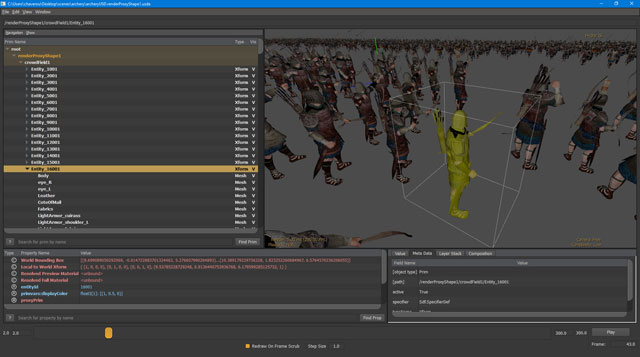

# Golaem For USD

Golaem For USD is a plugin which takes advantage of USD Dynamic Payloads to render Golaem Simulation Caches within USD compatible applications.
Thus, it avoids baking out geometry, handles geometry and shading variation and Golaem Layout edits.

###
## License
Golaem For USD source code is released under the [GNU Lesser General Public License v2.1](LICENSE).

###
## Prerequisites
- [Golaem 7.2.1 For Maya (or above)](http://download.golaem.com)
- USD 0.19.11
- FBX SDK 2019.0
> Please use the same version of Golaem For Maya than the Golaem For USD tag you're compiling

###
## Documentation
Official documentation for the plugin can be found here: [http://usd.golaem.com](http://usd.golaem.com)

###
## Compilation
1. Use CMake 3.13 (or above) and set the GOLAEMUSD_STANDALONE_BUILD to True
2. Locate the Golaem For Maya Devkit, USD build and FBX SDK Directories
3. Configure and Generate your solution
4. Open the generated solution with your favorite IDE 

###
## Changelog
Changelog for the plugin can be found here: [ChangeLog](CHANGELOG)
